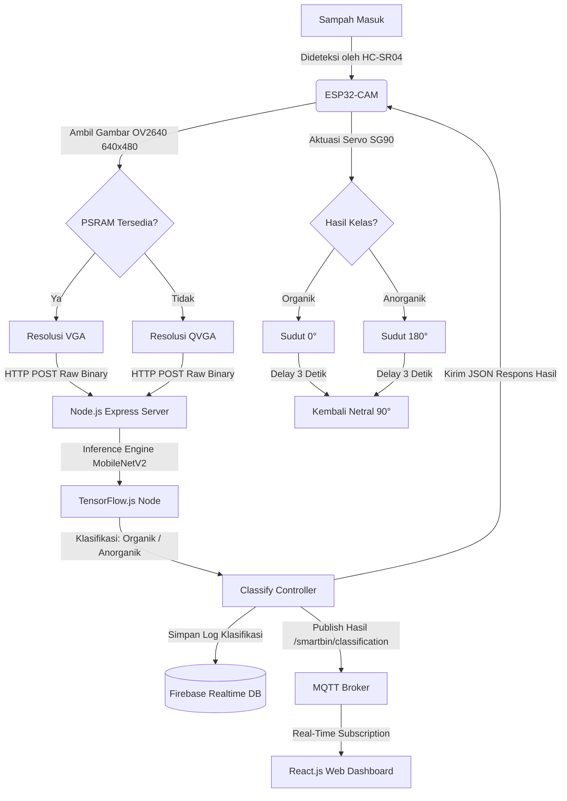

# 🗑️ Smart Bin: Sistem Pemilahan Sampah Otomatis Berbasis Computer Vision & IoT

[](https://github.com/ZharfanFw/pemilahan-sampah-iot)
[](https://tensorflow.org)
[](https://espressif.com)
[](https://firebase.google.com)
[](https://creativecommons.org/licenses/by-sa/4.0/)

Sistem tempat sampah pintar (**Smart Bin**) pemilah sampah otomatis secara *real-time* berbasis **Internet of Things (IoT)** dan **Computer Vision**. Proyek ini mengintegrasikan pengambilan gambar di perangkat *edge* (ESP32-CAM), pemrosesan kecerdasan buatan (*deep learning*) di server backend lokal (Node.js + TensorFlow.js), basis data *real-time* (Firebase), dan visualisasi data interaktif melalui dashboard web (React + MQTT).

---

## 📸 Demo & Tampilan Sistem

```
               [ +---------------------------------------+ ]
               |             Web Dashboard               | <=== MQTT Broker
               |       (Status Bin, Log, Statistik)      |       (Real-Time)
               [ +-------------------+-------------------+ ]
                                     ^
                                     | Sinkronisasi Data
                                     v
                       [ +-----------+-----------+ ]
                       | Firebase Realtime DB    |
                       [ +-----------+-----------+ ]
                                     ^
                                     | Simpan Log & Status
                                     v
 [ +---------------+ ] HTTP POST     [ +---------------+ ]
 |   ESP32-CAM     | --------------> |  Node.js Server |
 | (Kamera OV2640) | <-------------- |  (TFJS-Node /   |
 [ +-------+-------+ ]  (Organik /   |  MobileNetV2)   |
           |            Anorganik)   [ +---------------+ ]
           v Aktuasi
   [ Motor Servo SG90 ]
   (0° Organik | 180° Anorganik)
```

---

## ⚡ Fitur Utama

- **Automatic Vision-Based Sorting**: Mengambil citra sampah otomatis menggunakan modul kamera **OV2640** pada **ESP32-CAM** dan memilahnya secara fisik melalui aktuasi **Motor Servo SG90**.
- **High-Performance AI Inference**: Menggunakan arsitektur model *deep learning* **MobileNetV2** yang disederhanakan dan dioptimasi dengan **TensorFlow.js (tfjs-node)** pada server lokal, mencapai akurasi **88.4%** dengan waktu inferensi cepat (**~200-400 ms**).
- **Decoupled Edge-Server Architecture**: Mengatasi keterbatasan memori mikrokontroler dengan memindahkan komputasi inferensi ke server lokal menggunakan protokol transmisi biner **HTTP POST** mentah yang hemat bandwidth.
- **Stabilisasi Catu Daya**: Mengimplementasikan kapasitor decoupling **1000µF** pada rangkaian perangkat keras guna mencegah *brownout reset* pada ESP32-CAM saat motor servo berputar tanpa memerlukan catu daya eksternal tambahan.
- **Real-Time Web Dashboard**: Memantau kapasitas tempat sampah, volume pemilahan harian, statistik sampah organik vs anorganik, dan riwayat klasifikasi secara instan menggunakan **MQTT (Publish-Subscribe)** dan **Firebase Realtime Database**.

---

## 🏗️ Arsitektur Sistem

Aliran data sistem dari pendeteksian sampah fisik hingga visualisasi di dashboard dapat dilihat pada diagram berikut:



---

## 📊 Hasil Riset & Evaluasi Performa

### 1. Performa Model Klasifikasi (MobileNetV2 Transfer Learning)
Model dilatih menggunakan dataset *Waste Classification Data* sebanyak 25.077 gambar biner. Hasil pengujian pada data uji (2.513 gambar) memberikan metrik berikut:

| Kelas | Precision | Recall | F1-Score | Jumlah Data (Support) |
| :--- | :---: | :---: | :---: | :---: |
| **Organik** | `0.84` | `0.98` | `0.90` | 1401 |
| **Anorganik** | `0.97` | `0.76` | `0.85` | 1112 |
| **Akurasi Rata-rata** | | | **`88.4%`** | **2513** |

> [!NOTE]
> Nilai **Precision Anorganik (0.97)** sangat tinggi, yang berarti hampir tidak ada sampah organik yang salah masuk ke kompartemen anorganik. Hal ini sangat penting untuk menjaga kemurnian bahan daur ulang dari kontaminasi zat organik.

### 2. Latensi Sistem End-to-End
Waktu respons sistem dari pendeteksian awal hingga pemilahan fisik adalah **1.4 hingga 1.8 detik**, dengan rincian berikut:
- **Pengambilan Gambar (Capture)**: ~100 ms
- **Transmisi Jaringan (HTTP POST)**: ~400 - 600 ms
- **Inferensi Model AI (TFJS Server)**: ~200 - 400 ms
- **Aktuasi Servo**: ~100 ms

---

## 📂 Struktur Repositori

```bash
pemilahan-sampah-iot/
├── client/                 # Aplikasi Frontend Dashboard (React + Vite + TailwindCSS)
│   ├── src/
│   │   ├── pages/          # Dashboard, Riwayat, Pengaturan, Login
│   │   └── services/       # Integrasi Firebase & MQTT
│   └── package.json
├── server/                 # Aplikasi Backend Server (Node.js Express + TensorFlow.js)
│   ├── services/           # Classification Engine (Singleton TFJS) & Workers
│   ├── routes/             # API Endpoints (/api/classify)
│   ├── ml-model/           # Model MobileNetV2 TFJS terkonversi (.json & .bin shards)
│   └── server.js
├── esp32cam/               # Firmware Arduino untuk Perangkat Keras
│   └── esp32cam_waste_classifier/
│       └── esp32cam_waste_classifier.ino
├── model/                  # Script Training & Augmentasi Model Deep Learning (Python)
│   ├── train_model.py      # Script training model dengan MobileNetV2 (Keras)
│   ├── convert_model.py    # Script konverter Keras (.h5) ke TFJS format
│   └── requirements.txt
└── README.md
```

---

## 🚀 Panduan Instalasi & Penggunaan

### 1. Prasyarat Sistem
Pastikan Anda telah memasang:
- **Node.js** (v18.x atau v20.x disarankan)
- **Python** (3.9 - 3.11) + **PIP** (untuk melatih kembali model)
- **Arduino IDE** (dengan dukungan board ESP32 terinstal)

---

### 2. Pengembangan Model Deep Learning (Python)
Jika Anda ingin melatih kembali model klasifikasi menggunakan dataset lokal:

1. Masuk ke direktori model:
   ```bash
   cd model
   ```
2. Instal semua dependensi Python:
   ```bash
   pip install -r requirements.txt
   ```
3. Jalankan skrip pelatihan:
   ```bash
   python train_model.py
   ```
   *Skrip ini akan otomatis mengunduh dataset, melakukan data augmentation, melatih model dengan transfer learning (2 fase), dan mengekspor model langsung ke direktori `server/ml-model/`.*

---

### 3. Konfigurasi & Menjalankan Server Node.js

1. Masuk ke direktori server:
   ```bash
   cd server
   ```
2. Instal pustaka dependensi (termasuk modul TensorFlow.js native):
   ```bash
   npm install
   ```
3. Konfigurasikan variabel lingkungan dengan membuat file `.env` di dalam folder `server/`:
   ```env
   PORT=5000
   FIREBASE_DB_URL=https://<your-project-id>.firebaseio.com
   MQTT_BROKER_URL=mqtt://broker.emqx.io
   ```
4. Masukkan file kredensial Firebase Admin SDK Anda (`serviceAccountKey.json`) ke folder `server/config/`.
5. Jalankan server dalam mode development:
   ```bash
   npm run dev
   ```
   *Server akan memuat model kecerdasan buatan secara otomatis saat startup. Anda akan melihat log `✅ Classification model ready!` jika model berhasil termuat.*

---

### 4. Konfigurasi & Upload ESP32-CAM Firmware

1. Buka aplikasi **Arduino IDE**.
2. Instal library yang dibutuhkan melalui **Library Manager**:
   - `ArduinoJson` (oleh Benoit Blanchon)
   - `ESP32Servo` (oleh Kevin Harrington)
3. Buka file firmware `esp32cam/esp32cam_waste_classifier/esp32cam_waste_classifier.ino`.
4. Sesuaikan konfigurasi jaringan WiFi dan alamat IP Server Node.js Anda:
   ```cpp
   const char* ssid = "NAMA_WIFI_ANDA";
   const char* password = "PASSWORD_WIFI_ANDA";
   const char* serverName = "http://IP_SERVER_ANDA:5000/api/classify";
   ```
5. Pilih Board: **AI Thinker ESP32-CAM**.
6. Hubungkan modul ESP32-CAM ke komputer menggunakan FTDI programmer. Pasang jumper antara **GPIO 0** dan **GND** untuk mengaktifkan mode flash/upload.
7. Tekan tombol **Upload** di Arduino IDE. Setelah selesai, lepas jumper GPIO 0-GND dan tekan tombol RESET di ESP32-CAM.
8. Buka **Serial Monitor** dengan baudrate `115200` untuk memantau proses klasifikasi sampah.

---

### 5. Menjalankan Web Dashboard (React + Vite)

1. Masuk ke direktori client:
   ```bash
   cd client
   ```
2. Instal dependensi frontend:
   ```bash
   npm install
   ```
3. Jalankan aplikasi web lokal:
   ```bash
   npm run dev
   ```
4. Buka peramban (browser) Anda di alamat `http://localhost:5173`. Anda sekarang dapat memantau visualisasi kapasitas smart bin dan log klasifikasi secara *real-time*!

---

## 🔌 Skema Pin Out Perangkat Keras

Berikut adalah koneksi kabel antara ESP32-CAM dengan sensor serta aktuator fisik:

| Komponen Perangkat Keras | Pin ESP32-CAM | Detail Deskripsi |
| :--- | :---: | :--- |
| **Servo Motor SG90 (Signal)** | `GPIO 12` | Aktuator fisik pemilah sampah |
| **Sensor Ultrasonik HC-SR04 (Trig)** | `GPIO 13` | Deteksi jarak & objek masuk |
| **Sensor Ultrasonik HC-SR04 (Echo)** | `GPIO 14` | Pengukur jarak waktu pantul gelombang |
| **Push Button (Trigger Manual)** | `GPIO 15` | Opsional untuk pengujian manual capture |
| **Kapasitor Decoupling** | `5V` & `GND` | **1000µF / 16V** dipasang paralel untuk mencegah brownout |

---

## 📜 Lisensi & Kontributor

Proyek riset ini dirancang, diuji, dan dikembangkan oleh:
- **Rizki Maulana** - Universitas Pendidikan Indonesia
- **Alun Sujjada** - Universitas Nusa Putra
- **Anggun Fergina** - Universitas Nusa Putra

Dilisensikan di bawah lisensi internasional [Creative Commons Attribution-ShareAlike 4.0 (CC BY-SA 4.0)](https://creativecommons.org/licenses/by-sa/4.0/). Anda dipersilakan menyebarluaskan, memodifikasi, dan membangun kembali proyek ini dengan tetap mencantumkan kredit atribusi penulis asli.