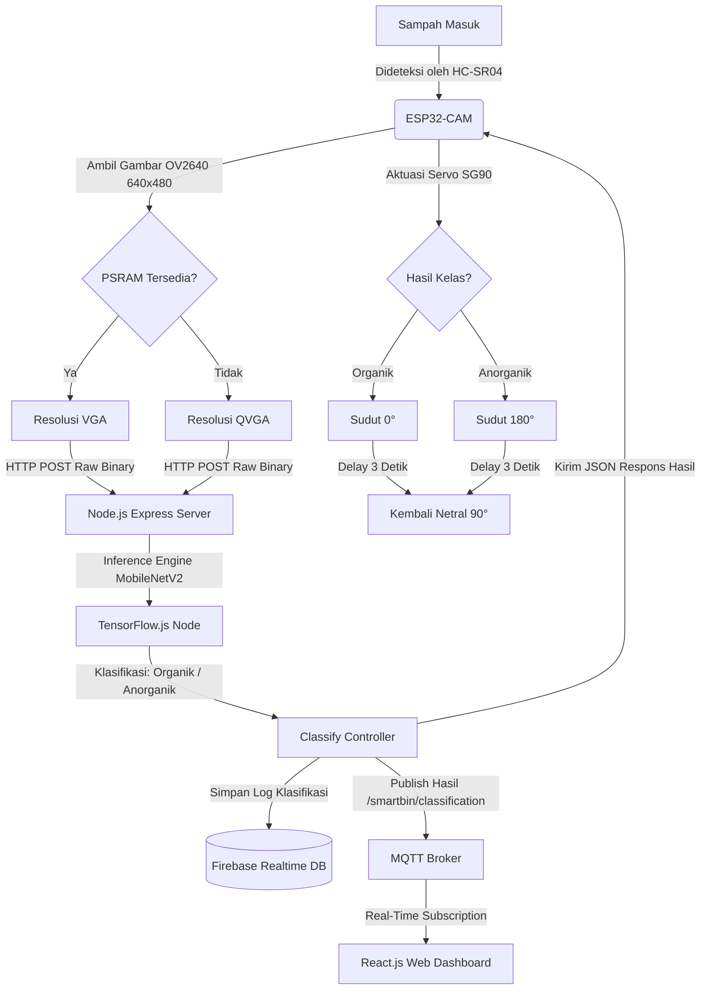

# 🗑️ Smart Bin: Sistem Pemilahan Sampah Otomatis Berbasis Computer Vision & IoT

[](https://github.com/ZharfanFw/pemilahan-sampah-iot)
[](https://tensorflow.org)
[](https://espressif.com)
[](https://firebase.google.com)
[](https://creativecommons.org/licenses/by-sa/4.0/)

Sistem tempat sampah pintar (**Smart Bin**) pemilah sampah otomatis secara *real-time* berbasis **Internet of Things (IoT)** dan **Computer Vision**. Proyek ini mengintegrasikan pengambilan gambar di perangkat *edge* (ESP32-CAM), pemrosesan kecerdasan buatan (*deep learning*) di server backend lokal (Node.js + TensorFlow.js), basis data *real-time* (Firebase), dan visualisasi data interaktif melalui dashboard web (React + MQTT).

---

## 📸 Demo & Tampilan Sistem

```
               [ +---------------------------------------+ ]
               |             Web Dashboard               | <=== MQTT Broker
               |       (Status Bin, Log, Statistik)      |       (Real-Time)
               [ +-------------------+-------------------+ ]
                                     ^
                                     | Sinkronisasi Data
                                     v
                       [ +-----------+-----------+ ]
                       | Firebase Realtime DB    |
                       [ +-----------+-----------+ ]
                                     ^
                                     | Simpan Log & Status
                                     v
 [ +---------------+ ] HTTP POST     [ +---------------+ ]
 |   ESP32-CAM     | --------------> |  Node.js Server |
 | (Kamera OV2640) | <-------------- |  (TFJS-Node /   |
 [ +-------+-------+ ]  (Organik /   |  MobileNetV2)   |
           |            Anorganik)   [ +---------------+ ]
           v Aktuasi
   [ Motor Servo SG90 ]
   (0° Organik | 180° Anorganik)
```

---

## ⚡ Fitur Utama

- **Automatic Vision-Based Sorting**: Mengambil citra sampah otomatis menggunakan modul kamera **OV2640** pada **ESP32-CAM** dan memilahnya secara fisik melalui aktuasi **Motor Servo SG90**.
- **High-Performance AI Inference**: Menggunakan arsitektur model *deep learning* **MobileNetV2** yang disederhanakan dan dioptimasi dengan **TensorFlow.js (tfjs-node)** pada server lokal, mencapai akurasi **88.4%** dengan waktu inferensi cepat (**~200-400 ms**).
- **Decoupled Edge-Server Architecture**: Mengatasi keterbatasan memori mikrokontroler dengan memindahkan komputasi inferensi ke server lokal menggunakan protokol transmisi biner **HTTP POST** mentah yang hemat bandwidth.
- **Stabilisasi Catu Daya**: Mengimplementasikan kapasitor decoupling **1000µF** pada rangkaian perangkat keras guna mencegah *brownout reset* pada ESP32-CAM saat motor servo berputar tanpa memerlukan catu daya eksternal tambahan.
- **Real-Time Web Dashboard**: Memantau kapasitas tempat sampah, volume pemilahan harian, statistik sampah organik vs anorganik, dan riwayat klasifikasi secara instan menggunakan **MQTT (Publish-Subscribe)** dan **Firebase Realtime Database**.

---

## 🏗️ Arsitektur Sistem

Aliran data sistem dari pendeteksian sampah fisik hingga visualisasi di dashboard dapat dilihat pada diagram berikut:


```mermaid
graph TD
    A[Sampah Masuk] -->|Dideteksi oleh HC-SR04| B(ESP32-CAM)
    B -->|Ambil Gambar OV2640 640x480| C{PSRAM Tersedia?}
    C -->|Ya| D[Resolusi VGA]
    C -->|Tidak| E[Resolusi QVGA]
    D & E -->|HTTP POST Raw Binary| F[Node.js Express Server]
    F -->|Inference Engine MobileNetV2| G[TensorFlow.js Node]
    G -->|Klasifikasi: Organik / Anorganik| H[Classify Controller]
    H -->|Kirim JSON Respons Hasil| B
    B -->|Aktuasi Servo SG90| I{Hasil Kelas?}
    I -->|Organik| J[Sudut 0°]
    I -->|Anorganik| K[Sudut 180°]
    J & K -->|Delay 3 Detik| L[Kembali Netral 90°]
    H -->|Simpan Log Klasifikasi| M[(Firebase Realtime DB)]
    H -->|Publish Hasil /smartbin/classification| N[MQTT Broker]
    N -->|Real-Time Subscription| O[React.js Web Dashboard]
```

---

## 📊 Hasil Riset & Evaluasi Performa

### 1. Performa Model Klasifikasi (MobileNetV2 Transfer Learning)
Model dilatih menggunakan dataset *Waste Classification Data* sebanyak 25.077 gambar biner. Hasil pengujian pada data uji (2.513 gambar) memberikan metrik berikut:

| Kelas | Precision | Recall | F1-Score | Jumlah Data (Support) |
| :--- | :---: | :---: | :---: | :---: |
| **Organik** | `0.84` | `0.98` | `0.90` | 1401 |
| **Anorganik** | `0.97` | `0.76` | `0.85` | 1112 |
| **Akurasi Rata-rata** | | | **`88.4%`** | **2513** |

> [!NOTE]
> Nilai **Precision Anorganik (0.97)** sangat tinggi, yang berarti hampir tidak ada sampah organik yang salah masuk ke kompartemen anorganik. Hal ini sangat penting untuk menjaga kemurnian bahan daur ulang dari kontaminasi zat organik.

### 2. Latensi Sistem End-to-End
Waktu respons sistem dari pendeteksian awal hingga pemilahan fisik adalah **1.4 hingga 1.8 detik**, dengan rincian berikut:
- **Pengambilan Gambar (Capture)**: ~100 ms
- **Transmisi Jaringan (HTTP POST)**: ~400 - 600 ms
- **Inferensi Model AI (TFJS Server)**: ~200 - 400 ms
- **Aktuasi Servo**: ~100 ms

---

## 📂 Struktur Repositori

```bash
pemilahan-sampah-iot/
├── client/                 # Aplikasi Frontend Dashboard (React + Vite + TailwindCSS)
│   ├── src/
│   │   ├── pages/          # Dashboard, Riwayat, Pengaturan, Login
│   │   └── services/       # Integrasi Firebase & MQTT
│   └── package.json
├── server/                 # Aplikasi Backend Server (Node.js Express + TensorFlow.js)
│   ├── services/           # Classification Engine (Singleton TFJS) & Workers
│   ├── routes/             # API Endpoints (/api/classify)
│   ├── ml-model/           # Model MobileNetV2 TFJS terkonversi (.json & .bin shards)
│   └── server.js
├── esp32cam/               # Firmware Arduino untuk Perangkat Keras
│   └── esp32cam_waste_classifier/
│       └── esp32cam_waste_classifier.ino
├── model/                  # Script Training & Augmentasi Model Deep Learning (Python)
│   ├── train_model.py      # Script training model dengan MobileNetV2 (Keras)
│   ├── convert_model.py    # Script konverter Keras (.h5) ke TFJS format
│   └── requirements.txt
└── README.md
```

---

## 🚀 Panduan Instalasi & Penggunaan

### 1. Prasyarat Sistem
Pastikan Anda telah memasang:
- **Node.js** (v18.x atau v20.x disarankan)
- **Arduino IDE** (dengan dukungan board ESP32 terinstal)
- **Koneksi WiFi** 2.4 GHz (ESP32-CAM tidak mendukung WiFi 5 GHz)

---

### 2. Pengaturan Firebase
Proyek ini membutuhkan Firebase Realtime Database untuk menyimpan log riwayat dan status bin secara real-time.
1. Masuk ke [Firebase Console](https://console.firebase.google.com/).
2. Buat proyek baru dan aktifkan **Realtime Database**. Salin URL Database Anda (contoh: `https://your-project-id.firebaseio.com/`).
3. Masuk ke **Project Settings** -> **Service Accounts**.
4. Klik tombol **"Generate new private key"** (Buat kunci privat baru) dan unduh file JSON-nya.
5. Simpan file JSON tersebut di dalam direktori `server/` dan ganti namanya menjadi: `smart-waste-iot-firebase-adminsdk.json`.

---

### 3. Konfigurasi & Menjalankan Server Node.js (Backend + MQTT Broker)
Server backend Node.js bertindak sebagai API server (inferensi AI) sekaligus sebagai MQTT Broker lokal menggunakan **Aedes**.

1. Buka terminal/cmd dan masuk ke direktori server:
   ```bash
   cd server
   ```
2. Instal semua dependensi (termasuk TensorFlow.js):
   ```bash
   npm install
   ```
3. Buat file `.env` di dalam folder `server/` dan konfigurasikan seperti berikut:
   ```env
   PORT=3000
   MQTT_BROKER_URL=mqtt://127.0.0.1:1883
   FIREBASE_DATABASE_URL=https://<your-project-id>-default-rtdb.asia-southeast1.firebasedatabase.app/
   NODE_ENV=development
   CORS_ORIGIN=http://localhost:5173
   ```
   *Sesuaikan `FIREBASE_DATABASE_URL` dengan URL database Firebase Anda.*
4. Jalankan server dalam mode development:
   ```bash
   npm run dev
   ```
   *Saat startup, server akan otomatis memuat model AI (MobileNetV2), menjalankan MQTT Broker lokal di port `1883`, dan menghubungkan client MQTT server ke broker lokal.*

---

### 4. Konfigurasi & Menjalankan Web Dashboard (React + Vite)
Aplikasi frontend menggunakan React dan Vite untuk visualisasi dashboard.

1. Buka terminal baru dan masuk ke direktori client:
   ```bash
   cd client
   ```
2. Instal dependensi frontend:
   ```bash
   npm install
   ```
3. Jalankan aplikasi web lokal:
   ```bash
   npm run dev
   ```
4. Buka peramban (browser) di alamat `http://localhost:5173`. Halaman dashboard akan mengambil data secara otomatis ke port `3000` (backend).

---

### 5. Konfigurasi & Upload Firmware ESP32-CAM
Bagian ini mengatur agar ESP32-CAM dapat mengambil foto, mengirimkannya ke Node.js via HTTP POST, dan menerima instruksi aktuasi servo via MQTT.

1. Buka aplikasi **Arduino IDE**.
2. Instal library berikut via **Library Manager**:
   - `ArduinoJson` (oleh Benoit Blanchon)
   - `ESP32Servo` (oleh Kevin Harrington)
   - `PubSubClient` (oleh Nick O'Leary)
3. Buka file firmware `esp32cam/esp32cam_waste_classifier/esp32cam_waste_classifier.ino`.
4. Sesuaikan konfigurasi WiFi dan IP Server Anda pada baris kode berikut:
   ```cpp
   // WiFi credentials
   const char* WIFI_SSID     = "SSID_WIFI_ANDA";     
   const char* WIFI_PASSWORD = "PASSWORD_WIFI_ANDA"; 

   // Ganti dengan IP lokal komputer/server Anda (gunakan cmd > ipconfig)
   const char* SERVER_IP   = "IP_SERVER_LOCAL_ANDA"; 
   const int   SERVER_PORT = 3000;
   const int   MQTT_PORT   = 1883;
   ```
5. Pilih Board: **AI Thinker ESP32-CAM** (pastikan library Board ESP32 sudah terinstal di Arduino IDE).
6. Hubungkan ESP32-CAM ke komputer menggunakan modul FTDI programmer. Sambungkan pin **GPIO 0** ke **GND** pada ESP32-CAM agar masuk ke mode flash/upload, lalu tekan tombol RESET pada ESP32-CAM.
7. Tekan tombol **Upload** di Arduino IDE. Setelah selesai, **lepas kabel jumper GPIO 0 - GND**, dan tekan kembali tombol RESET pada ESP32-CAM.
8. Buka **Serial Monitor** (Baudrate `115200`) untuk melihat debug log koneksi WiFi, MQTT, dan sensor.

---

## 🔌 Skema Pin Out Perangkat Keras

Berikut adalah skema koneksi kabel antara ESP32-CAM dengan sensor serta aktuator fisik sesuai dengan kode firmware:

| Komponen Perangkat Keras | Pin ESP32-CAM | Keterangan Deskripsi |
| :--- | :---: | :--- |
| **Servo Motor SG90 (Signal)** | `GPIO 12` | Mengontrol arah tutup tempat sampah |
| **Sensor IR Obstacle (OUT)** | `GPIO 13` | Mendeteksi objek sampah masuk di depan kamera |
| **Sensor Ultrasonik HC-SR04 (Trig)** | `GPIO 14` | Trigger pengukuran kedalaman bin (Organik & Anorganik) |
| **Sensor Ultrasonik HC-SR04 (Echo Organik)** | `GPIO 15` | Echo untuk mengukur kapasitas tempat sampah organik |
| **Sensor Ultrasonik HC-SR04 (Echo Anorganik)** | `GPIO 2` | Echo untuk mengukur kapasitas tempat sampah anorganik |
| **Kapasitor Decoupling** | `5V` & `GND` | **1000µF / 16V** dipasang paralel untuk mencegah brownout reset saat servo bergerak |ger Manual)** | `GPIO 15` | Opsional untuk pengujian manual capture |
| **Kapasitor Decoupling** | `5V` & `GND` | **1000µF / 16V** dipasang paralel untuk mencegah brownout |

---

## 📜 Lisensi & Kontributor

Proyek riset ini dirancang, diuji, dan dikembangkan oleh:
- **Arya** - Universitas Pendidikan Indonesia
- **Alan** - Universitas Pendidikan Indonesia
- **Maul** - Universitas Pendidikan Indonesia
- **Muhiban** - Universitas Pendidikan Indonesia
- **Zharfan** - Universitas Pendidikan Indonesia

Dilisensikan di bawah lisensi internasional [Creative Commons Attribution-ShareAlike 4.0 (CC BY-SA 4.0)](https://creativecommons.org/licenses/by-sa/4.0/). Anda dipersilakan menyebarluaskan, memodifikasi, dan membangun kembali proyek ini dengan tetap mencantumkan kredit atribusi penulis asli.
