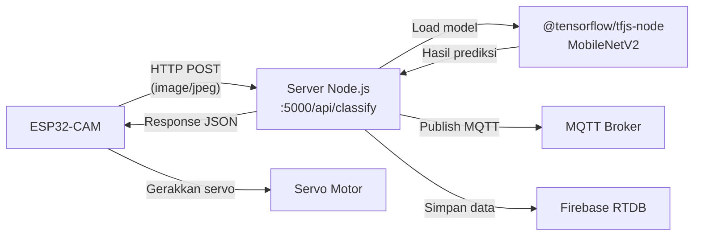

# Model Klasifikasi Sampah Organik vs Anorganik (ESP32-CAM)

Membuat model image classification menggunakan **MobileNetV2 (transfer learning)** untuk memilah sampah **Organik** dan **Anorganik**, lalu deploy di server Node.js yang sudah ada agar ESP32-CAM bisa mengirim gambar dan menerima hasil klasifikasi.

## Arsitektur Sistem



## User Review Required

> [!IMPORTANT]
> **Dataset**: Akan menggunakan [Kaggle - Waste Classification Data](https://www.kaggle.com/datasets/techsash/waste-classification-data) oleh Sashaank Sekar. Dataset ini berisi ~25.000 gambar dengan 2 kelas: **Organic** (O) dan **Recyclable** (R). Kelas "Recyclable" akan kita perlakukan sebagai "Anorganik". Apakah ini sesuai?

> [!WARNING]
> **ESP32-CAM Pin Configuration**: Kode Arduino akan menggunakan konfigurasi pin default untuk **AI-Thinker ESP32-CAM** module. Jika Anda menggunakan board yang berbeda, konfigurasi pin perlu disesuaikan. Mohon konfirmasi board ESP32-CAM mana yang Anda gunakan.

## Open Questions

1. **WiFi Credentials**: Apakah ESP32-CAM akan terhubung ke jaringan WiFi lokal yang sama dengan server? Jika iya, saya akan hardcode IP server di kode Arduino.
2. **Resolusi Kamera**: ESP32-CAM mendukung beberapa resolusi. Untuk model ini input adalah 224×224px. Apakah ingin capture di resolusi rendah (QVGA 320×240) untuk kecepatan, atau lebih tinggi (VGA 640×480) untuk akurasi?
3. **Servo Logic**: Setelah klasifikasi, apakah servo sudah ada logikanya di kode ESP32 Anda, atau perlu saya buatkan juga? (misal: Organik → servo ke kiri, Anorganik → servo ke kanan)
4. **Training Environment**: Apakah Anda punya akun Google untuk menggunakan **Google Colab** (gratis GPU), atau ingin training secara lokal di PC?

---

## Proposed Changes

Proyek ini dibagi menjadi **4 komponen utama**:

### Komponen 1: Training Model (Python)

Folder baru `model/` di root proyek, berisi notebook dan script untuk training.

#### [NEW] [train_model.py](file:///c:/Maulana/College/CODING/Semester%204/IOT/Tubes/Project/pemilahan-sampah-iot/model/train_model.py)

Script Python untuk training model yang bisa dijalankan di lokal maupun Google Colab.

**Isi utama:**
- Download dataset dari Kaggle via `kaggle` CLI atau `opendatasets`
- Preprocessing: resize 224×224, normalisasi [0,1], data augmentation (flip, rotation, zoom, brightness)
- Arsitektur:
  ```
  MobileNetV2 (pretrained ImageNet, frozen) 
    → GlobalAveragePooling2D 
    → Dropout(0.3) 
    → Dense(128, relu) 
    → Dropout(0.3) 
    → Dense(1, sigmoid)  ← binary classification
  ```
- Training strategy:
  1. **Phase 1**: Train hanya custom head (10-15 epochs, lr=1e-3)
  2. **Phase 2**: Fine-tune top 30 layers MobileNetV2 (10 epochs, lr=1e-5)
- Callbacks: EarlyStopping, ReduceLROnPlateau, ModelCheckpoint
- Evaluasi: accuracy, precision, recall, F1-score, confusion matrix
- Export model ke format **TensorFlow.js** (`model.json` + shard `.bin` files)

#### [NEW] [requirements.txt](file:///c:/Maulana/College/CODING/Semester%204/IOT/Tubes/Project/pemilahan-sampah-iot/model/requirements.txt)

Dependencies Python:
```
tensorflow>=2.15.0
tensorflowjs>=4.0.0
numpy
matplotlib
scikit-learn
Pillow
opendatasets
```

#### [NEW] [convert_model.py](file:///c:/Maulana/College/CODING/Semester%204/IOT/Tubes/Project/pemilahan-sampah-iot/model/convert_model.py)

Script terpisah untuk konversi model Keras (.h5) ke format TFJS:
```bash
tensorflowjs_converter --input_format=keras model/waste_classifier.h5 server/ml-model/
```

---

### Komponen 2: Inference Service di Server Node.js

Menambahkan endpoint dan service klasifikasi di server yang sudah ada.

#### [NEW] [classificationService.js](file:///c:/Maulana/College/CODING/Semester%204/IOT/Tubes/Project/pemilahan-sampah-iot/server/services/classificationService.js)

Service baru untuk inference menggunakan `@tensorflow/tfjs-node`:
- Load model TFJS saat server startup (singleton, load 1x saja)
- Method `classify(imageBuffer)`:
  1. Decode JPEG buffer → tensor
  2. Resize ke 224×224
  3. Normalize pixel values [0, 1]
  4. Run inference (model.predict)
  5. Return `{ jenis: "Organik"|"Anorganik", confidence: 0.95 }`
- Threshold confidence: ≥ 0.5 → Organik, < 0.5 → Anorganik

#### [NEW] [classifyController.js](file:///c:/Maulana/College/CODING/Semester%204/IOT/Tubes/Project/pemilahan-sampah-iot/server/controllers/classifyController.js)

Controller untuk handle endpoint klasifikasi:
- `POST /api/classify` — menerima image/jpeg dari ESP32-CAM
  - Parse raw binary body (`express.raw`)
  - Panggil `classificationService.classify(req.body)`
  - Simpan hasil ke Firebase (reuse logic dari `mqttService.handleClassification`)
  - Publish ke MQTT topic `smartbin/classification`
  - Return JSON response: `{ success, jenis, confidence }`

#### [NEW] [classify.js](file:///c:/Maulana/College/CODING/Semester%204/IOT/Tubes/Project/pemilahan-sampah-iot/server/routes/classify.js)

Route baru:
```javascript
router.post("/", express.raw({ type: "image/jpeg", limit: "5mb" }), classifyController.classify);
```

#### [MODIFY] [server.js](file:///c:/Maulana/College/CODING/Semester%204/IOT/Tubes/Project/pemilahan-sampah-iot/server/server.js)

Perubahan:
- Import dan register route baru: `app.use("/api/classify", classifyRoutes)`
- Initialize classification service (load model) saat startup

#### [NEW] `server/ml-model/` directory

Folder untuk menyimpan file model TFJS hasil konversi:
- `model.json` — arsitektur model
- `group1-shard1of1.bin` (atau beberapa shard) — weights

---

### Komponen 3: Kode ESP32-CAM (Arduino)

#### [NEW] [esp32cam_waste_classifier.ino](file:///c:/Maulana/College/CODING/Semester%204/IOT/Tubes/Project/pemilahan-sampah-iot/esp32cam/esp32cam_waste_classifier.ino)

Sketch Arduino untuk ESP32-CAM:
- **Setup**: Inisialisasi kamera (AI-Thinker pinout), WiFi connect, servo attach
- **Loop**:
  1. Capture foto (JPEG, resolusi QVGA/VGA)
  2. HTTP POST ke `http://SERVER_IP:5000/api/classify` dengan body = raw JPEG bytes
  3. Parse JSON response (`jenis`, `confidence`)
  4. Gerakkan servo berdasarkan hasil:
     - Organik → servo ke posisi 0° (kiri)
     - Anorganik → servo ke posisi 180° (kanan)
  5. Delay beberapa detik, kembali ke posisi netral
- **Trigger**: Bisa pakai button/sensor IR untuk trigger capture (opsional)

---

### Komponen 4: Update Dependencies

#### [MODIFY] [package.json](file:///c:/Maulana/College/CODING/Semester%204/IOT/Tubes/Project/pemilahan-sampah-iot/server/package.json)

Tambah dependency baru:
```json
"@tensorflow/tfjs-node": "^4.22.0"
```

#### [MODIFY] [.gitignore](file:///c:/Maulana/College/CODING/Semester%204/IOT/Tubes/Project/pemilahan-sampah-iot/.gitignore)

Tambahkan:
```
# ML Model training data
model/dataset/
model/*.h5
model/saved_model/

# Keep ml-model for TFJS converted model (committed to repo)
# server/ml-model/ ← ini di-commit
```

---

## Struktur File Akhir

```
pemilahan-sampah-iot/
├── model/                          ← [NEW] Training Python
│   ├── train_model.py              ← Script training
│   ├── convert_model.py            ← Konversi ke TFJS
│   ├── requirements.txt            ← Python dependencies
│   └── dataset/                    ← Download dataset (gitignored)
│
├── esp32cam/                       ← [NEW] Arduino sketch
│   └── esp32cam_waste_classifier.ino
│
├── server/
│   ├── ml-model/                   ← [NEW] TFJS model files
│   │   ├── model.json
│   │   └── group1-shard*.bin
│   ├── services/
│   │   ├── mqttService.js          ← existing
│   │   └── classificationService.js ← [NEW]
│   ├── controllers/
│   │   ├── binController.js        ← existing
│   │   ├── wasterController.js     ← existing
│   │   └── classifyController.js   ← [NEW]
│   ├── routes/
│   │   ├── auth.js                 ← existing
│   │   └── classify.js             ← [NEW]
│   ├── server.js                   ← [MODIFY] add classify route
│   └── package.json                ← [MODIFY] add tfjs-node
│
├── client/                         ← existing (tidak diubah)
└── .gitignore                      ← [MODIFY]
```

---

## Verification Plan

### Automated Tests

1. **Model Training Verification**:
   ```bash
   cd model
   python train_model.py
   # Expect: val_accuracy > 90%, model saved to waste_classifier.h5
   ```

2. **Model Conversion Verification**:
   ```bash
   python convert_model.py
   # Expect: model.json + .bin files created in server/ml-model/
   ```

3. **Server Inference Test**:
   ```bash
   cd server
   npm install
   # Test dengan curl:
   curl -X POST http://localhost:5000/api/classify \
     -H "Content-Type: image/jpeg" \
     --data-binary @test_image.jpg
   # Expect: { "success": true, "jenis": "Organik", "confidence": 0.95 }
   ```

4. **End-to-end Test**: Upload gambar sampah organik dan anorganik via curl, verifikasi response benar

### Manual Verification

1. Upload sketch ke ESP32-CAM, verifikasi bisa capture & kirim gambar
2. Verifikasi servo bergerak sesuai hasil klasifikasi
3. Verifikasi data tersimpan di Firebase Realtime Database
4. Verifikasi MQTT message ter-publish ke topic `smartbin/classification`
